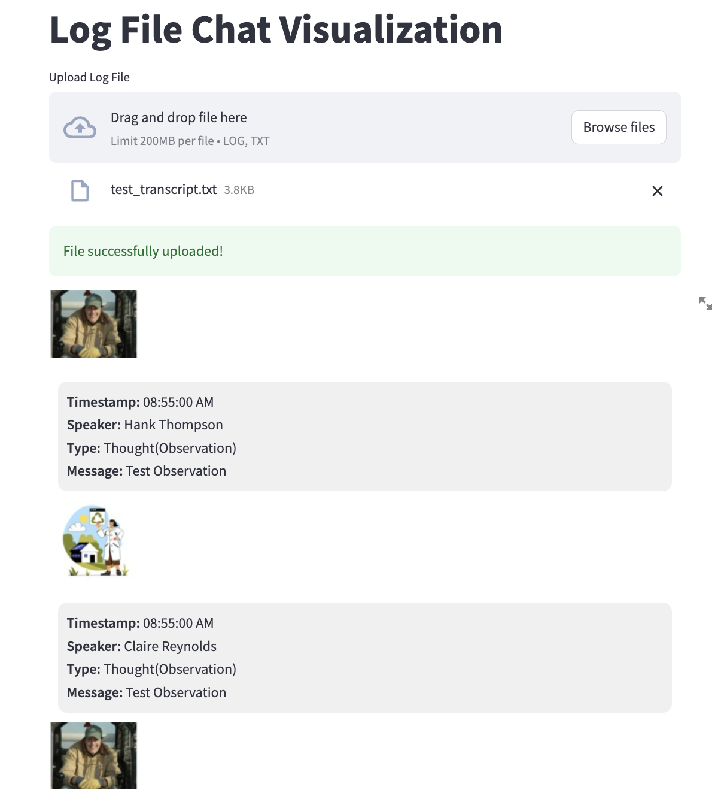

### Frontend code for visualization

Install streamlit

`pip install streamlit`

Then, `streamlit run conversation_visualizer.py`

And then drag one of the transcript files into the file upload, and should see the bubbles.

### Example
